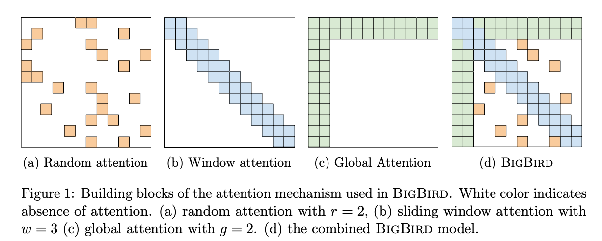
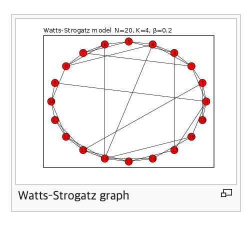
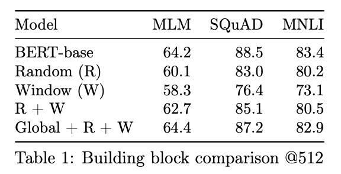
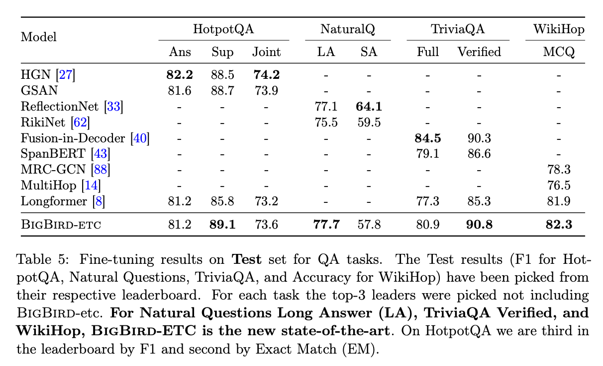
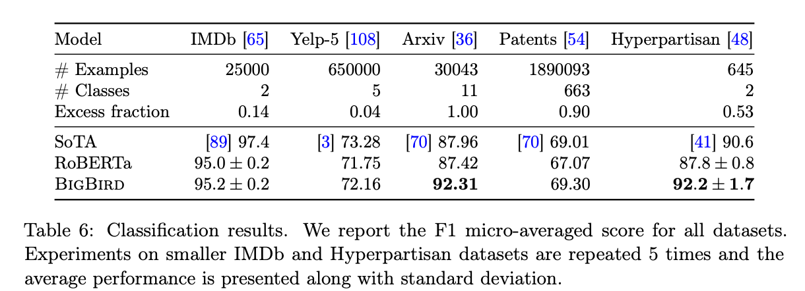
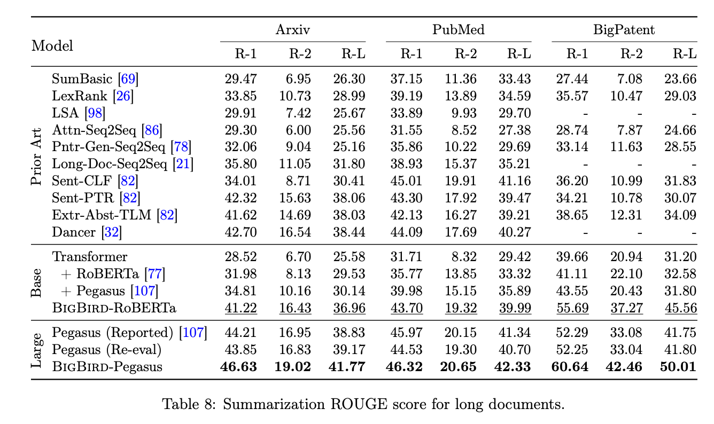

## Big Bird: Transformers for Longer Sequences

### Reference

- [arXiv](https://arxiv.org/abs/2007.14062)

### Summary

- 기존 Transformer는 full attention을 보기 때문에 O(n^2)의 complexity를 갖는다.
- Big Bird는 full attention 대신 O(n)의 complexity를 갖는 attention을 제안한다. 이는 다음 3가지를 포함한다.
  - Random attention
  - Window attention
  - Global attention

### Big Bird

#### Window attention

- locality of reference: a great deal of information about a token can be derived from its neighboring tokens.
- NLP의 self-attention model에서도 neighboring이 중요

### Random attention

- Watts and Strogatz model

  
  - window attention에 random attention을 끼얹으면 Watts-Strogatz graph와 유사해짐. (같지는 않음. Watts-Strogatz graph는 기존 local connection을 없애지만, 여기서는 유지시키기 때문)

### Global attnetion

- inspired from the theoretical analysis
- 모든 token을 보고, 모든 token이 보는 "global token" 도입

- 실험적으로도 Random + Window 만으로는 BERT의 성능에 도달하기 어렵고, Global 이 있어야 BERT의 성능에 도달했음.

## Experiment

- MLM Pre-training을 했으며, public RoBERTa checkpoint로 warm-starting.

#### Encoder only task

- longer document, fewer training example에 대해 BigBird가 더 significant 했음.

### Encoder-Decoder Tasks

- Encoder는 BigBird를 적용하고, decoder는 full attention 사용

- BigBird-Pegasus는 Pegasus로 warm start