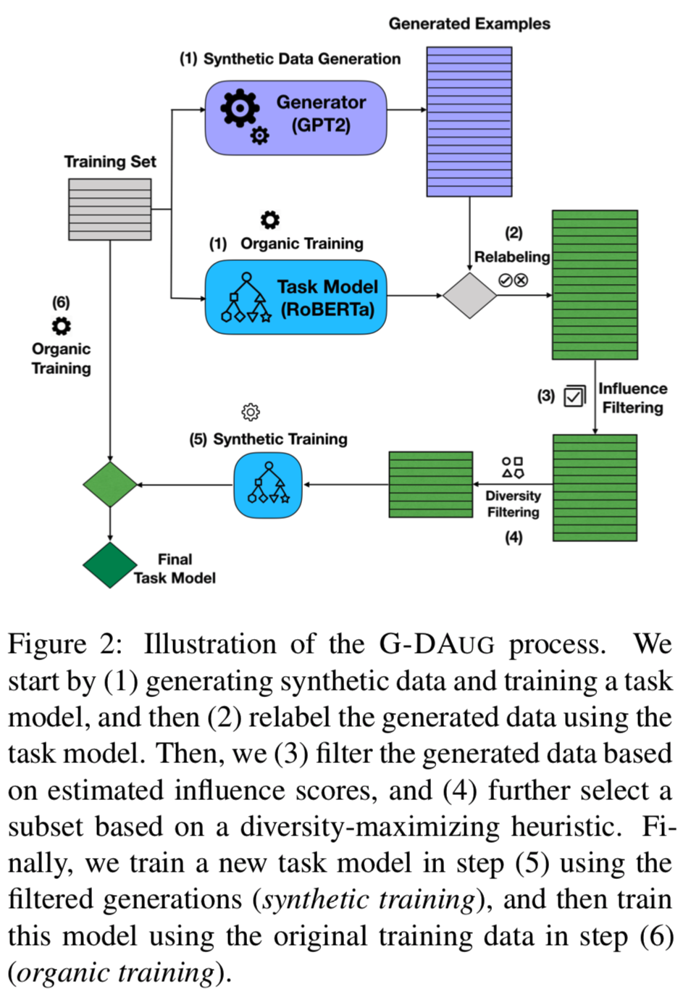
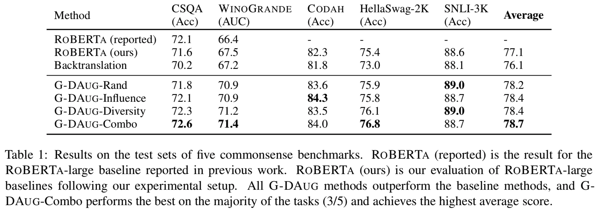
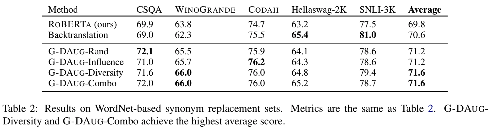
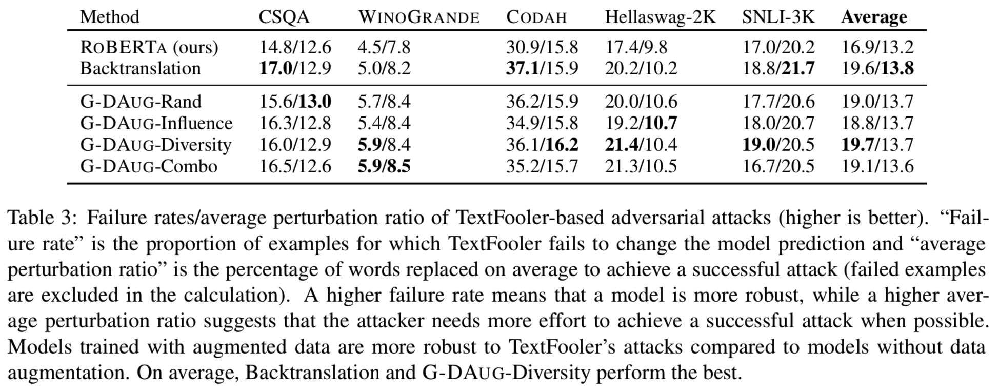
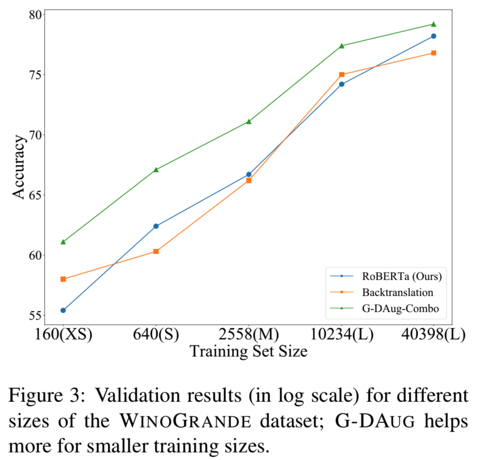

# G-DAUG: Generative Data Augmentation for Commonsense Reasoning

Yang et al. (Northwestern University, Allen Institute of AI, University of Washington)

arXiv (2020.04)

## References

- [arXiv](https://arxiv.org/abs/2004.11546)

### More on Data Augmentation for NLP

- [Conditional BERT Contextual Augmentation](https://arxiv.org/abs/1812.06705)
- [Unsupervised Data Augmentation for Consistency Training](https://arxiv.org/abs/1904.12848)
- [Good-Enough Compositional Data Augmentation](https://arxiv.org/abs/1904.09545)
- [Learning Data Manipulation for Augmentation and Weighting](https://arxiv.org/abs/1910.12795)
- [Data Augmentation using Pre-trained Transformer Models](https://arxiv.org/abs/2003.02245)

## Summary

- This paper presents Generative Data Augmentation (G-DAUG), an augmentation framework for commonsense reasoning tasks using pre-trained language models and filtering techniques.
- G-DAUG establishes new state-of-the-art results on major commonsense reasoning benchmarks, including WinoGrande, Codah, and CommonsenseQA.
- Experiments show that G-DAUG produces a diverse set of fluent examples, and the resulting model shows robustness to adversarial attacks and other perturbations.

---

## G-DAUG

The overall process can be summarized as follows (also see Figure 2):

- **Generation**: A pre-trained language model (GPT-2) generates synthetic inputs and, if necessary, a task-specific model (fine-tuned RoBERTa) labels them.
- **Filtering**: Two filtering steps are employed to select *informative* (using influence functions) and *diverse* (using heuristics) examples.
- **Two-Stage Training**: A new task model is trained first on the filtered synthetic data (*synthetic training*) and then on the original training data (*organic training*).

### *Generating Multiple-Choice QA Data

The paper focuses on commonsense reasoning tasks, many of which can be formulated as a multiple-choice question-answering task, so the paper uses this task as a running example. 
The overall pipeline could be used in other forms of NLP tasks.

- **Question Generation**: fine-tune GPT-2 on the training set questions, and generate more using [nucleus (top-p) sampling](https://arxiv.org/abs/1904.09751).
- **Answer & Distractor Generation**: two separate fine-tuned GPT-2's for conditional answer generation and conditional distractor generation, respectively.
    - Answer generation uses low temperatures or greedy decoding for correctness, while distractor generation uses high (not lowered, to be exact) temperatures for diversity.
- **Data Relabeling**: Optional, especially when the generative process yields labels naturally as above. A task-specific model can be used here (self-training).

## Synthetic Data Selection

Synthetically generated datasets may contain near-duplicates or low-quality examples. 
Thus, the paper proposes filtering techniques for both quality and diversity. 
There are three variants and a baseline:
- **G-DAUG-Rand**: random baseline
- **G-DAUG-Influence**: use [influence](https://conservancy.umn.edu/handle/11299/37076) [functions](https://arxiv.org/abs/1703.04730) to filter out examples that are detrimental, i.e., training on them increases the average validation loss. (See Appendix F for details.)
- **G-DAUG-Diversity**: greedily select examples with unique n-grams (n=1) in the training set.
- **G-DAUG-Combo**: first apply G-DAUG-Influence and then apply G-DAUG-Diversity.

## Two-Stage Training

The final task model is trained first on the synthetic data and then on the original training data. 
Experimentally, this two-stage procedure outperforms a joint training procedure.

---

## Experiments

- Datasets: CommonsenseQA (CSQA), Codah, WinoGrande, HellaSwag (2k), SNLI (3k), ARC-Challenge Scientific QA (closed-book)
- Robustness Tests: synonym replacement with WordNet, adversarial perturbations with TextFooler
- Baseline models: RoBERTa, [UDA (via translation-and-backtranslation)](https://arxiv.org/abs/1904.12848)
- There are many more experimental results in the paper. Examples include comparisons of training strategies, labeling methods, and filtering methods.

### Main Results

All variants of G-DAUG improve upon both unaugmented and backtranslation-augmented baselines.

### WordNet Synonym Replacement

G-DAUG outperforms baselines on three of the five baselines. 
(Note that synonym replacement may or may not preserve correctness, but one can assume that models perform similarly on invalid examples.)

### TextFooler Adversarial Attacks

G-DAUG-Diversity and backtranslation perform the best overall, although backtranslation also hurts in-domain accuracy in most cases, according to the authors. 
All augmentation methods outperform the non-augmentation baseline.

### Training Data Sizes

> We find that G-DAUG remains effective as the amount of training data is varied, 
> but provides a bigger boost over the baseline in the low-resource (small training size) regime.

