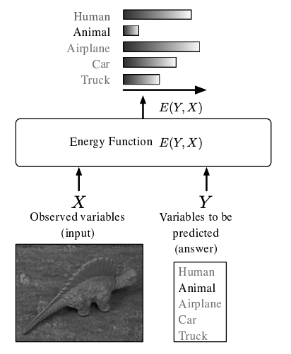
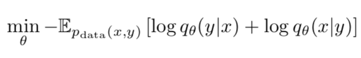
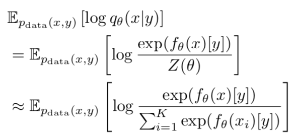
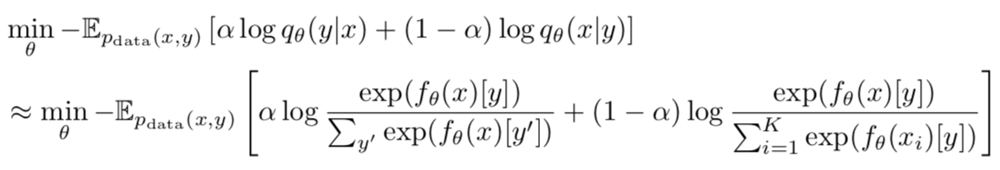
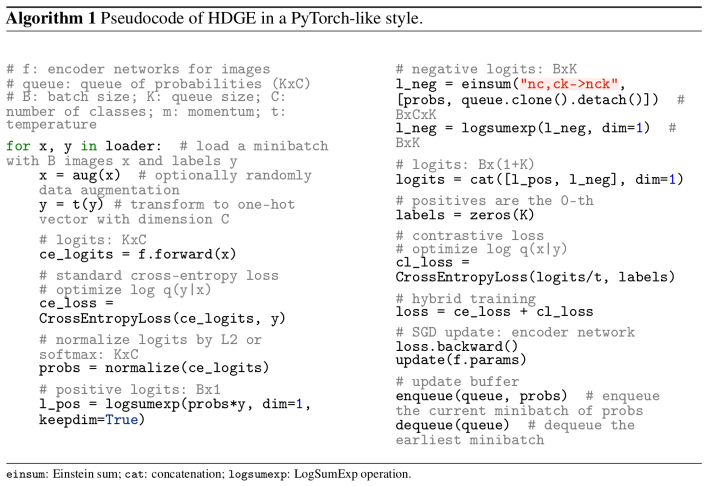
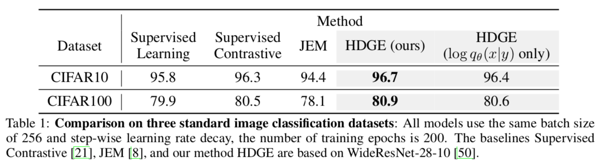
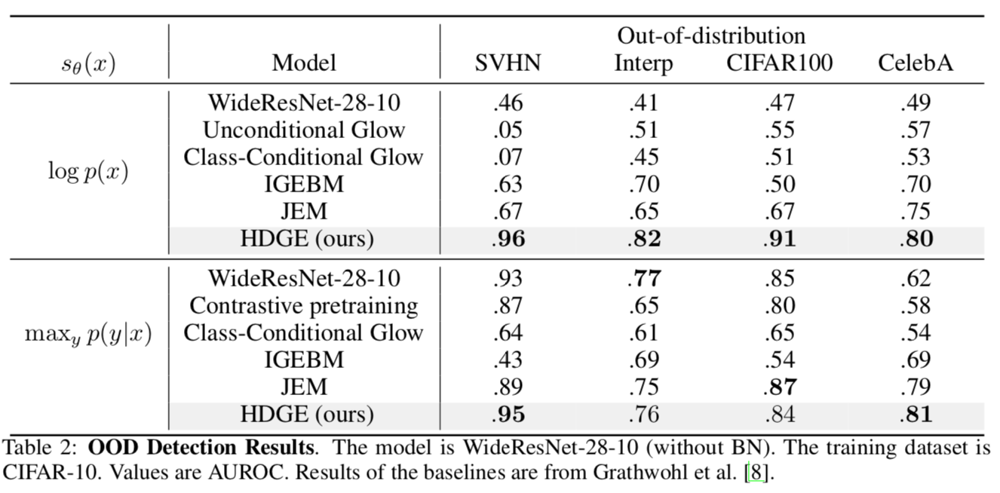
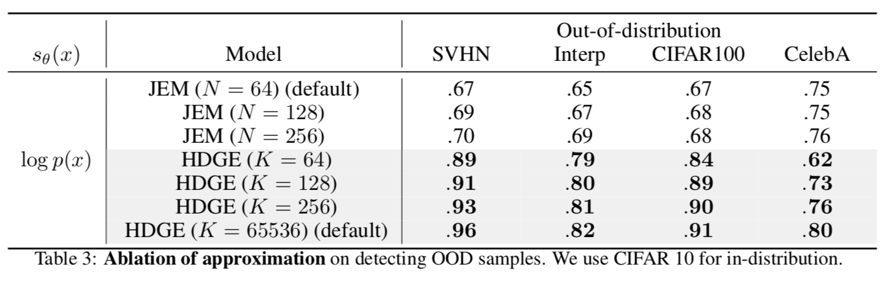
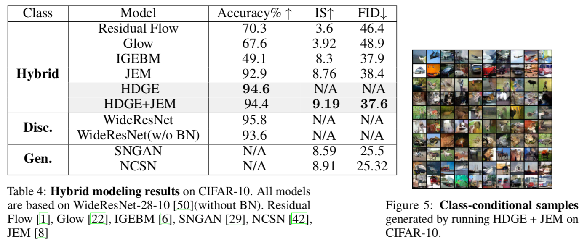

# Hybrid Discriminative-Generative Training via Contrastive Learning

Liu and Abbeel (UC Berkeley)

arXiv (2020)

## References

- [arXiv](https://arxiv.org/abs/2007.09070)
- [Code](https://github.com/lhao499/HDGE)
- [Your Classifier is Secretly an Energy Based Model and You Should Treat it Like One](https://arxiv.org/abs/1912.03263)
- [A Tutorial on Energy-Based Learning](A Tutorial on Energy-Based Learning)
- [On Discriminative vs. Generative Classifiers: A Comparison of Logistic Regression and Naive Bayes](https://ai.stanford.edu/~ang/papers/nips01-discriminativegenerative.pdf)

## Summary

- This paper presents a **hybrid discriminative-generative energy-based (HDGE) modeling** framework, inspired by early work that showed the hybrid approach is effective *and* by recent work that showed a softmax classifier can be interpreted as an energy-based model.
- By approximating the generative loss with a contrastive loss, HDGE gives a unified view of supervised learning and contrastive learning.
- Experiments show that HDGE performs competitively on standard classification tasks as well as generative tasks and OOD tasks, without the computational challenges of samplers used in other energy-based models.

---

## Background: Energy-Based Models and JEM

There is a large literature on **[energy-based models (EBMs)](http://yann.lecun.com/exdb/publis/pdf/lecun-06.pdf)**, so we'll have to only scratch the surface here. 
EBMs model the associations between input variables (and/or outputs) by defining an energy function *E* that assigns a score to each configuration of variables.

In fact, any probability density *p* can be expressed in terms of an energy function *E*:

where *Z* is the (usually intractable) normalization constant. 
The gradient of the negative log-likelihood involves sampling from the model distribution, and previous work often relies on MCMC-based methods, such as block Gibbs sampling for RBMs and (more recently) [stochastic gradient Langevin dynamics (SGLD)](https://www.ics.uci.edu/~welling/publications/papers/stoclangevin_v6.pdf) for deep neural networks.

In a recent work, Grathwohl et al. proposed **[joint energy-based models (JEM)](https://arxiv.org/abs/1912.03263)**, which is based on a re-interpretation of the popular softmax classifier's logits as the (negative) energy function of the joint data distribution. 
Intuitively, because any parametrized *K*-class classifier *f*, gives a score for each input-output pair, we can treat the score as the pair's negative energy. 
If we denote the softmax classifier as

where *f(***x***)[y]* refers to the logit corresponding to output *y* given input **x**, then simply by setting the energy function as

we can re-interpret the conditional softmax probability as the joint probability of an EBM (with an unknown normalizing constant). 

An interesting consequence of this derivation is that we can now also define a density function of the inputs, *p(x),* by marginalizing out *y*. 
The corresponding energy function is simply a log-sum-exp of all *K* logits:

Then, the log-likelihood of the joint input-output model can be optimized using the following factorization:

where the first term is the softmax classifier's loss and the second term can be optimized using the energy function derived above and SGLD.

Grathwohl et al. demonstrates that JEM improves adversarial robustness, calibration and out-of-distribution detection performance while also enables generating samples that "rival" the quality of those from GANs. Its in-domain classification accuracy (92.9% on CIFAR-10) is competitive with but lower than a purely discriminative approach (95.8%).

## Hybrid Discriminative Generative Energy-based Model (HDGE)

### Derivation

**HDGE** builds upon the re-interpretation of softmax logits for JEM, but takes inspiration from early work ([Ng and Jordan 2002](https://ai.stanford.edu/~ang/papers/nips01-discriminativegenerative.pdf); [Raina et al. 2004](https://papers.nips.cc/paper/2405-classification-with-hybrid-generativediscriminative-models.pdf)) showing that a hybrid of discriminative modeling, i.e., modeling *p(y|x)*, and generative modeling, i.e., modeling *p(x|y)*, can outperform purely discriminative or purely generative modeling.

Compared to JEM, which optimizes the joint log-likelihood, HDGE optimizes both the discriminative and generative conditional log-likelihoods:

where the first term is the discriminative softmax classification loss and the second term is the generative loss *conditioned on labels*. 
Note that, in JEM, the second term was marginalized out the labels. 

The main contribution of HDGE comes from how it optimizes the conditional generative loss, which involves an intractable normalization term over all possible inputs. 
Instead of using SGLD as in JEM, HDGE simply proposes to approximate it using other training inputs:

This approximation is interesting, because it is a form of **contrastive loss**: the summation is taken over *K-1* other examples that do not possess the same label as x, so it contrasts the logit value of x for y with the logit values of other examples for y. 
The authors claim that this approximation is "crude, but experimentally effective." 

In its final form, HDGE optimizes a convex combination of the discriminative and generative losses, which respectively correspond to supervised learning and contrastive learning.

### Implementation

Potentially the biggest issue with the formulation above is the quality of the contrastive loss approximation. 
The number of negative samples, *K*, has to be large, so HDGE keeps a memory bank to store previous logits (or their normalized versions), as done in [MoCo](https://arxiv.org/abs/1911.05722). 

Note that there is forward call and no additional sampling procedure in computing the total loss for each batch.

## Experiments

Many of the experiments build upon those from the JEM paper, including discriminative and generative performances, OOD detection, calibration, and adversarial robustness. 
Here we only highlight some of the results.

### Classification

HDGE outperforms JEM on classification, even when using the generative term only. 
It also slightly outperforms [supervised contrastive learning](https://arxiv.org/abs/2004.11362). 

### OOD Detection

HDGE outperforms most baselines for OOD detection, both in terms of input density and the predictive distribution. 
Note that the previous results are taken from the JEM paper.

### Goodness of Approximation

The big question from the HDGE formulation was how good the approximation of the generative log-likelihood was. When tested on OOD detection, HDGE performs better than JEM with similar batch sizes and even better when using large memory size.

### Generative Modeling

For generative modeling, the authors found that it is helpful to further add the marginal log-likelihood *p(x)* from JEM, although training would now involve SGLD. 
Note that the previous results are taken from the JEM paper.

