# Pattern-Exploiting Training

Schick and Schütze (LMU Munich & Sulzer GmbH)

arXiv:2001.07676, arXiv:2009.07118

## References

- **Paper 1 (PET and iPET):** [Exploiting Cloze Questions for Few Shot Text Classification and Natural Language Inference](https://arxiv.org/abs/2001.07676)
- **Paper 2 (PET for FewGLUE):** [It's Not Just Size That Matters: Small Language Models Are Also Few-Shot Learners](https://arxiv.org/abs/2009.07118)
- [PET Implementation](https://github.com/timoschick/pet)
- [FewGLUE](https://github.com/timoschick/fewglue)
- [Blog](https://www.pragmatic.ml/pet/)

## Summary

Paper 1:
- Proposes **pattern-exploiting training (PET)**, which combines the ideas of reformulating NLU tasks as cloze questions and knowledge distillation for few-shot fine-tuning.
- PET and its iterative variant (iPET) are shown to outperform both supervised and zero-shot approaches in low-resource settings.

Paper 2:
- Paper 1's PET assumes that every output can be verbalized into a single token. This follow-up work generalizes this to many tokens and applies it to all SuperGLUE tasks in a few-shot setting (named **"FewGLUE"**).
- On FewGLUE, PET and iPET outperform GPT-3 (in-context learning) while using a much smaller model (0.1% # of parameters).

---

## Introduction

**[GPT-3](https://github.com/kakaobrain/nlp-paper-reading/blob/master/notes/GPT-3.md)** is shown to possess impressive **few-shot** abilities on NLU tasks (e.g., SuperGLUE). But its priming (or **in-context learning**) strategy comes with two important caveats:
- It only works when the model size is exceedingly large.
- It is limited to few-shot examples that fit within the context window of the model.

On the other hand, **[pattern-exploiting training (PET)](https://arxiv.org/abs/2001.07676)** combines the idea of reformulating tasks as cloze questions while performing gradient-based optimization. This work shows that PET and its iterative variant (iPET) outperform GPT-3's in-context learning with only 0.1% of parameters used.

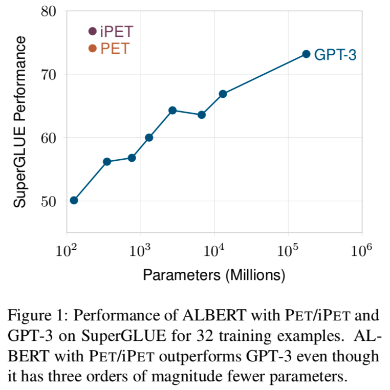

## Pattern-Exploiting Training

In PET, each supervised task of mapping an input x to an output y is reformulated into a cloze task via a set of **pattern-verbalizer pairs (PVPs)**. 
Here's an example of PVPs for recognizing textual entailment (RTE), from Figure 2:
- *pattern*: (Oil prices rise., Oil prices fall back.) → `Oil prices rise? ___, Oil prices fall back.`
- *verbalizer*: non-entailment → `No`

In this format, a pre-trained masked language model (MLM) can predict the output label simply by filling in the mask (with vocabulary masking).

There are several important details of PET that we will not get into here. These include:
- An **auxiliary MLM objective** using (much more) unlabeled examples, in order to prevent catastrophic forgetting. (S3.2, Paper 1)
- A **knowledge distillation** step to collect soft labels from different versions of PVPs (and ensembles) before using them all to train the final classifier. (S3.3, Paper 1)
- An **iterative** procedure of PET (**iPET**) to ensure that individual models (differentiated by which PVPs were used) can learn from each other during the distillation step. (S3.4 and Figure 2, Paper 1)
- An **automatic verbalizer search (AVS)** step that finds which existing token best represents each output label (random initialization - score - repeat). (S3.5, Paper 1)
- An extension to **multi-token verbalizers** (single forward step with hinge loss during training; k forward steps during inference). (S3.1, Paper 2)

Figure 1 from Paper 1 illustrates PET for sentiment analysis.

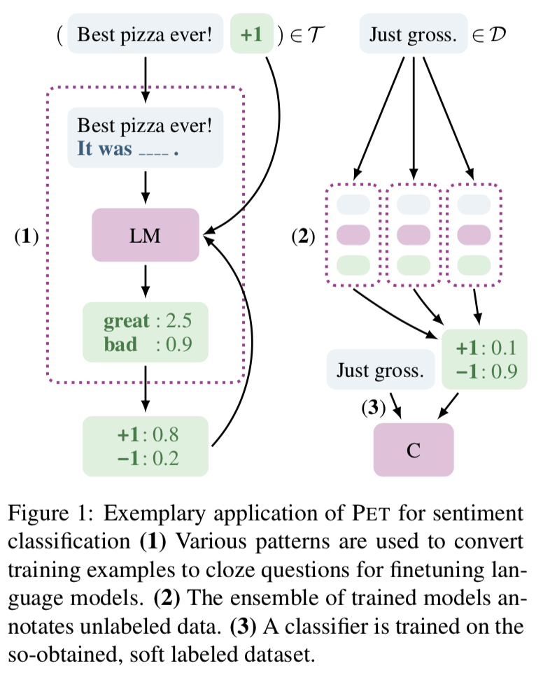

### Pattern-Verbalizer Pairs for NLU Tasks

It is not always obvious how to find PVPs for the task at hand, and PET can operate using multiple candidate PVPs for each task. 
Here are example patterns for some of the NLU tasks used.

- **Yelp Sentiment Analysis** (verbalizer: terrible, bad, okay, good, great)
    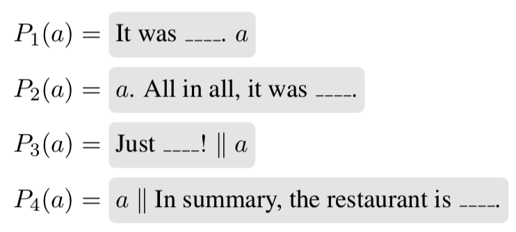
    
- **MNLI** (verbalizer: right, wrong, maybe; yes, no, maybe)
    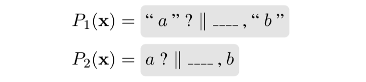
    
- **BoolQ Yes/No Reading Comprehension** (verbalizer: yes, no; true, false)
    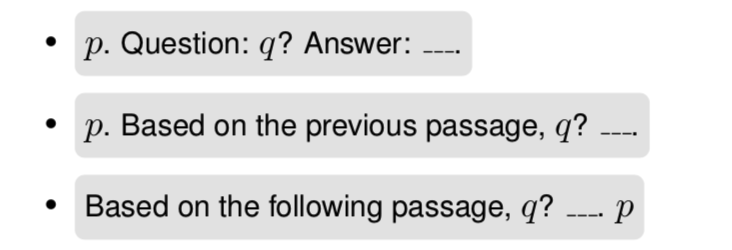
    
- **Winograd Schema Challenge** (verbalizer: see paper)
    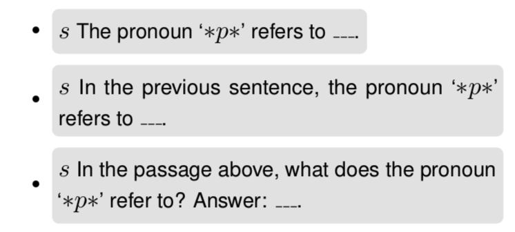

## Results

### vs. Supervised Baselines

PET/iPET applied to RoBERTa-large. From Paper 1.

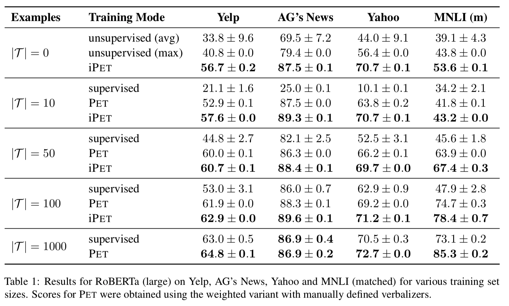

### vs. GPT-3 on FewGLUE

PET/iPET applied to ALBERT-xxlarge-v2. FewGLUE = 32-shot SuperGLUE. From Paper 2.

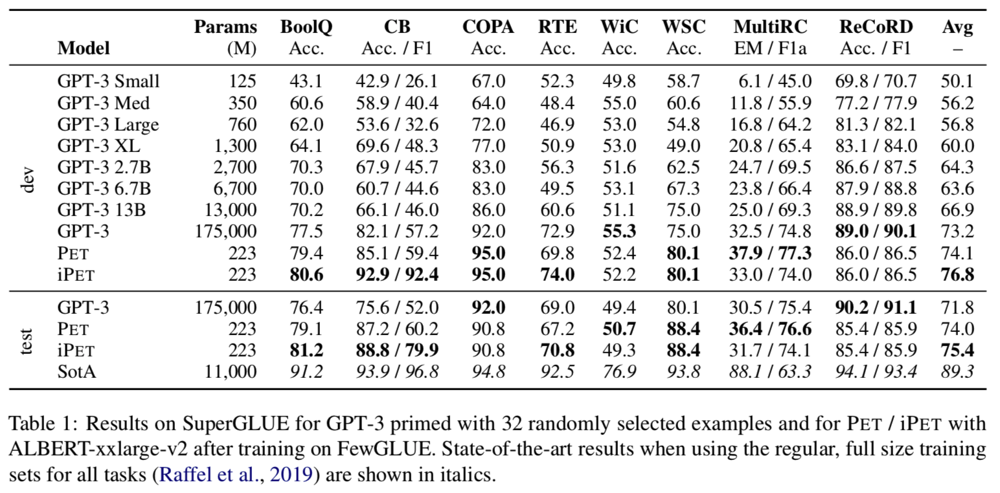

### Cross-Lingual Task (X-Stance)

PET/iPET can also be applied to XLM-R. From Paper 1.

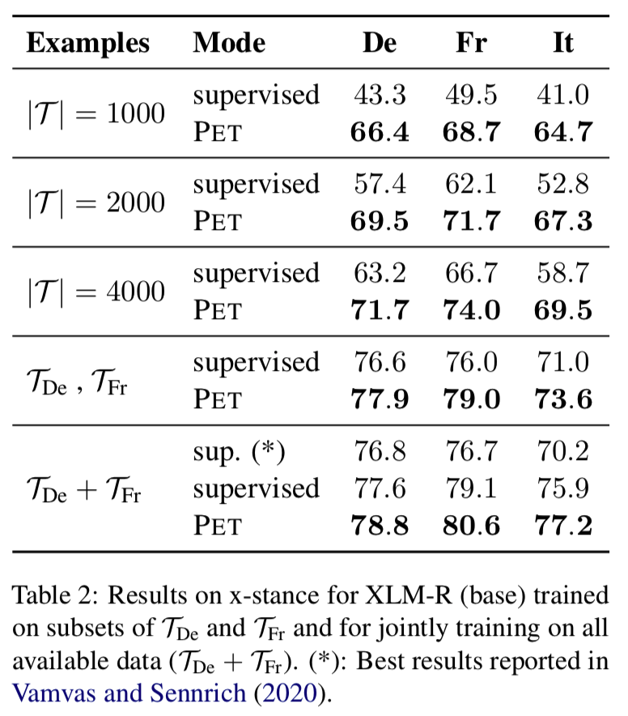

### Effect of Combining PVPs

This result shows that combining multiple PVPs, rather than using one, yields better performances across the board. From Paper 1.

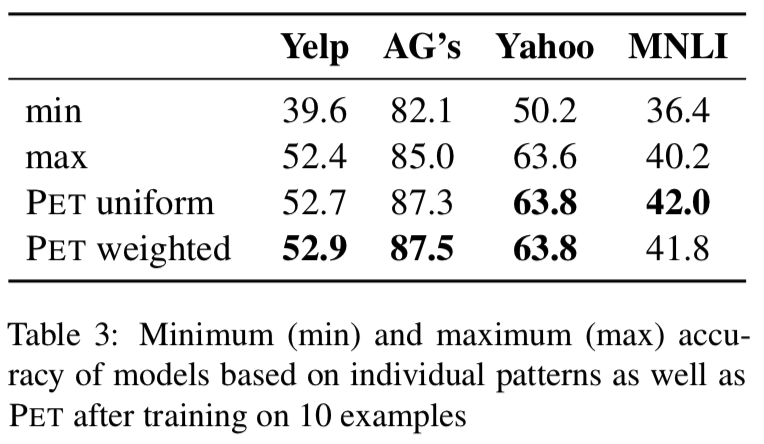

### Effect of Using Unlabeled Data

Supervised baselines can be improved by in-domain language modeling (e.g., ULMFiT), but that's not quite enough to overcome the gap with PET in few-shot scenarios. From Paper 1.

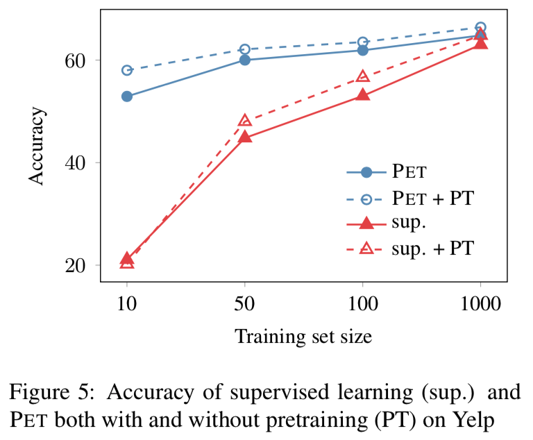

### Effect of Seeing More Examples vs. GPT-3

PET consistently benefits from seeing more examples (1-shot to 32-shot), but not so much for GPT-3's priming (in-context learning). From Paper 2.

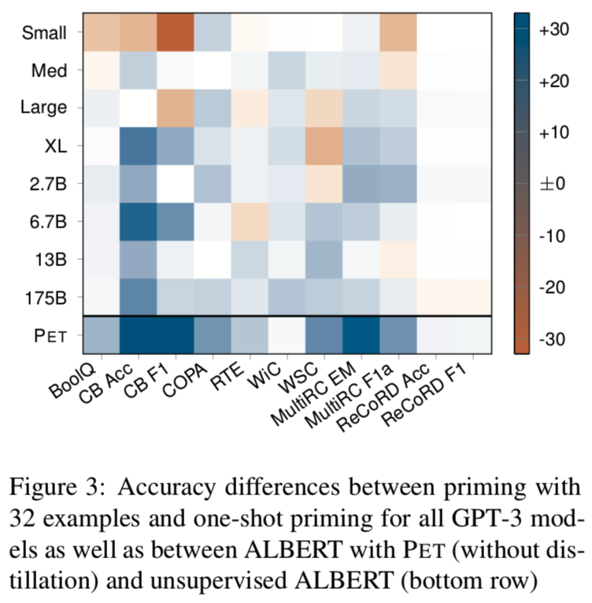

