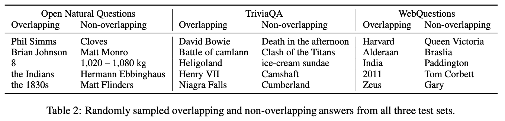
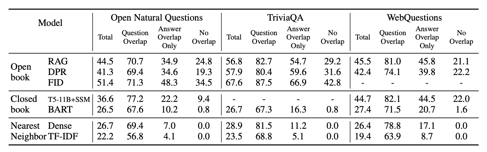

# Question and Answer Test-Train Overlap in Open-Domain Question Answering Datasets

Patrick Lewis, Pontus Stenetorp, and Sebastian Riedel (FAIR)

arXiv (2020)

## References

- [arXiv](https://arxiv.org/abs/2008.02637)
- [Code](https://github.com/facebookresearch/QA-Overlap)

## Summary

- Open Domain QA 데이터셋의 테스트 데이터를 분석해보니, 약 60%의 인스턴스는 트레이닝 데이터들과 "정답"을 공유했으며, 약 30%의 인스턴스는 "질문"을 공유
- 이러한 현상을 보았을 때, QA 모델의 성능을 단순히 테스트셋에 대한 Accuracy로 측정하는 것이 아닌 **Behaviour-drive evaluation**을 하는 것이 바람직함

---

## Abstract & Introduction

- **60-70%**의 테스트 데이터셋은 훈련 데이터셋과 "정답" 공유
- **30%**의 테스트 데이터셋은 훈련 데이터셋과 "질문" 공유
- 이러한 데이터들만 활용한 실험을 했을 때, Open Domain QA 모델들의 성능이 어떻게 변화하는지 살펴보자 !

 

## Experiments

- "정답"을 공유하는 기준:  테스트 데이터셋을 구성하는 (q, a) 쌍이 **참조하는 정답 관련 레퍼런스**가 하나라도 같은 인스턴스가 훈련 데이터셋에 있다면 해당 쌍은 훈련 데이터셋과 "정답"을 공유하는 인스턴스

- "질문"을 공유하는 기준
	- 모든 테스트 데이터셋에 대해 질문을 비교할 수 없으니, **1000개** 인스턴스 샘플링
	- 샘플링 된 1000개 (q, a) 쌍과 **같은 레퍼런스를 공유**하는 훈련 데이터셋 인스턴스를 **최대 50개** 추출
	- 50개 인스턴스와 (q, a) 쌍의 "질문"을 비교하며, 질문의 중복 여부에 대해 어노테이션
	- 1000개 인스턴스 중, **27.5~33.6%** 인스턴스는 훈련 데이터셋과 "질문" 중복
	- 중복 데이터 중 **81%**는 **1-2개 단어 바꿔치기**, **14%**는 **패러프레이즈**, **5%**는 더 **정밀한 이해 능력을 요하는 패러프레이즈**
- 앞서 구축한 Overlapped 데이터셋을 가지고 Open Domain QA 모델들에 대해 총 3개 능력 평가
	- _Question Memorization_: 모델이 훈련 데이터셋에서 학습한 모든 질문을 외운다면, "질문"이 중복된 (q, a) 쌍에 대해서는 좋은 성능 보일 것
	- _Answer Classification_:  모델이 단순히 훈련 과정에서 마주한 "정답"을 외우는 것이라면, 훈련 데이터셋에서 나온 모든 정답 셋에 대해서 분류하는 레이어를 사용하면 됨
	- _QA Generalization_:  정말 좋은 Open Domain QA 모델이라면 훈련 과정 중에 보지 않은, 질문과 정답에 대해서도 잘 맞출 수 있어야 함

 

## Result

- Retrieve를 수행하는 _Open book_, 수행하지 않고 Parametric knowledge를 쌓는 _Closed book_, 그리고 아무 훈련도 수행하지 않고 테스트 데이터셋의 질문과 가장 유사한 질문을 훈련 데이터셋에서 추출하고 그에 상응하는 답을 내뱉게 하는 _Nearesr Neighbor_ 모델 실험
- 결과를 보면 Open Domain QA 모델들의 대부분의 성능은 훈련 과정에서 나온 "질문"을 외워서 답변하는 **Question Overlap**에서 나오는 것을 확인할 수 있음
- **Answer Overlap Only**가 좋지 않은 성능을 보이는 것을 보면, 모델이 "정답"은 외울 수 있더라도, 질문이 다른 형식으로 주어지면 좋은 추론 능력을 보이지 않는 다는 것을 확인할 수 있음
- 훈련 과정 중 만나지 않은 "정답"을 마주처야 하는 No **Overlap**에 대해서는 좋지 않은 성능을 보이는 것을 확인할 수 있음
- 테스트 데이터의 질문과 훈련 데이터의 질문을 Question Embedding을 통해 비교한 후, 가장 유사한 훈련 데이터 쌍의 "정답"을 Fetch 하는 Nearset Neighbor의 Dense가 _Closed book_의 BART 보다 좋은 성능을 보이기도 함

