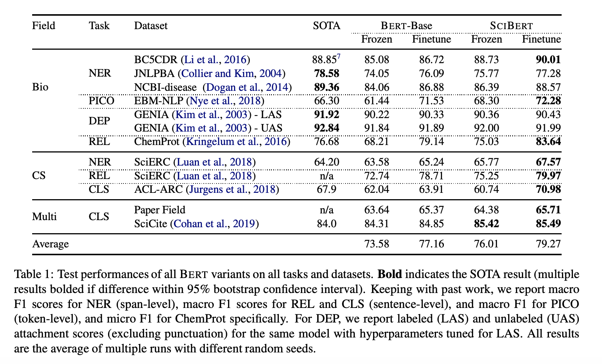
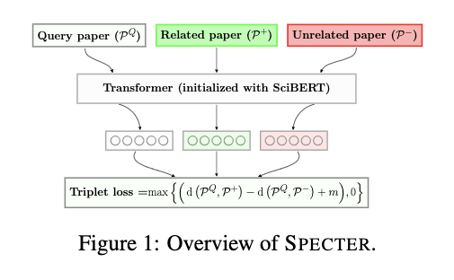
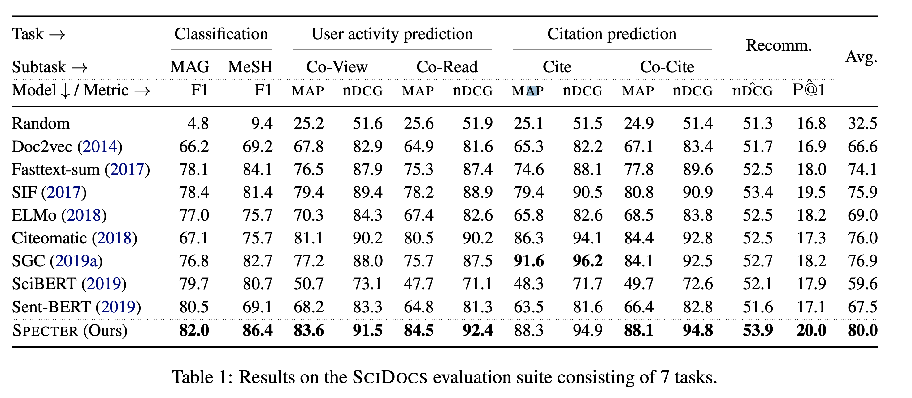
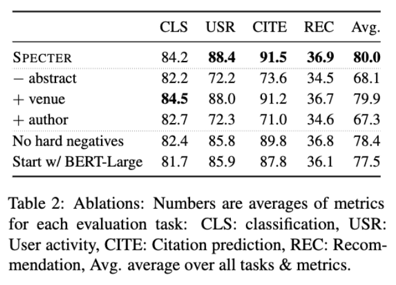
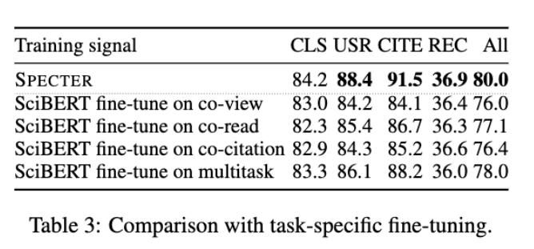

## SPECTER: Document-level Representation Learning using Citation-informed Transformers

Arman Cohan, Sergey Feldman, Iz Beltagy, Doug Downey, Daniel S. Weld

## References
- [arXiv](https://arxiv.org/pdf/2004.07180.pdf)
- [Code](https://arxiv.org/pdf/2004.07180.pdf)

## 1.  Abstract

1. 최근 Transformer 기반한 많은 LM 모델들은 learn powerful textual representation
2. 하지만 대다수의 LM 모델들은 **Token or Sentence-level** 에서 학습이 이루어지지만, Document-level 에서의 학습은 이루어지지 않음
3. 따라서, 이 논문에서는 Transformer 기반 **Scientific Document Embedding** 을 위한 **SPECTER*** 모델 제시 + **벤치마크 데이터 공개**

    ** **S**cientific **P**aper Embeddings using **C**itation-informed **T**ransfor**ER**s

## 2.  Introduction


### Background

- 최근 많은 양의 Scientific Publication → 사용자가 원하는 논문의 검색 혹은 추천에 NLP가 필요 → Hence, Science domain & Document embedding
- SPECTER 이전에도 Document Embedding의 연구가 있었지만 (Tu et al. 2017, Chen et al. 2019), BERT와 같은 SOTA pretrained LM은 적용하지 않음

### Document Processing

- 논문의 Title 과 Abstract 는 많은 정보를 내포하지만 ,이를 ~~주먹구구~~('off-the-shelf') 식으로 pretrained LM에 넣어주면 큰 의미가 없다 (see later)
- 가령, Science Domain에서 SOTA를 달성한 [SciBERT](https://arxiv.org/pdf/1903.10676.pdf) (BERT*_base* + 1.18M Paper)
    - [ ]  기존 BERT 모델에 118만개의 페이퍼 (from Semantic Scholar, 18% CS, 82% BioMedic) 데이터를 Fine-tuned
    - [ ]  SciBERT Result
   
   


- SPECTER는 논문간의 Citation을 **naturally occurring signal** → Which documents are most related and apply triplet-loss for objective function
- 이를 통해 Document-level의 여러 Task에서 (topic classification, citation prediction, recommendation) 에서 SOTA

## 3.  Model

---

### Overview



### Triplet

- Each training instance is a triplet of papers : a **Query paper** $P^{Q}$, a **Positive paper** $P^{+}$ and a **Negative paper** $P^{-}$
    - [ ]  Positive paper :  paper that is cited by Q
    - [ ]  Negative paper : paper that is NOT cited by Q (*but could be cited by* $P^{+}$ )
        1. Random Negative
            - Choose a random paper from the corpus
        2.  Hard Negative
            - A paper which is NOT cited by Query paper but IS cited by Positive paper
- Loss Function
    - $Triplet \: Loss\:\: = \: max{(d(P^{Q}, P^{+})-d(P^{Q},P^{-}) + m),\:0}$
    - The L2 norm distance is used : $d(P^{A}, P^{B})=\left \| v_{A}-v_{B} \right \|_{2}$

### Encoder & Data

- Use SciBERT for **foundation** and **fine-tune** it with Semantic Scholar data
    - [ ]  146K query papers for train, 32K papers for validation
    - [ ]  For each train Query paper → 5 distinct triplets

        ```markdown
        ## Emperically found that 2 hard negatives and 3 random negatives are 'helpful'

        | Query | Positive   | Negative  |
        |-------|------------|-----------|
        | Q1    | Citation 1 | Hard_Neg1 |
        | Q1    | Citation 2 | Hard_Neg2 |
        | Q1    | Citation 3 | Rand_Neg1 |
        | Q1    | Citation 4 | Rand_Neg2 |
        | Q1    | Citation 5 | Rand_Neg3 |
        ```

- Encoder Input = **SciBERT( [CLS] Title  + [SEP] + Abstract)**, ~~rather than CONCAT[SciBERT(Title), SciBERT(Abstact)]~~
- Use **[CLS] token** of the last layer for **final document embedding**
- During inference, *no citations are required*

### SciDocs

Introduce a new comprehensive evaluation framework to measure the *effectiveness of scientific paper embeddings* **(SCIDOCS**)

1. Document Classification (F1-score)
    - [ ]  Medical Subject Headings (MeSH)  Classification → 11 classes
    - [ ]  Paper Topic Classification → 19 classes
2. Citation Prediction (Ranking, MAP & nDCG score)
    - [ ]  Direct Citation
        - Predict which papers are cited by a given query paper from a given set of candidate papers (5 cited + 25 random)
    - [ ]  Co-Ciation
        - Predict which papers are highly co-cited with a given query paper from a given set of candidate papers
3. User-Activitiy (Ranking, MAP & nDCG score)
    - [ ]  Co-Views
        - Predict which papers are viewed within the same browser
    - [ ]  Co-Reads (Ranking, P@1 score)
        - Predict which papers are read while a user is reading a query paper

4. Recommendation
    - [ ]  Based on user's ***clickthrough data***, rank a given set of candidate papers

** For details of ***MAP*** and ***nDCG*** score, please see [this link](https://medium.com/swlh/rank-aware-recsys-evaluation-metrics-5191bba16832)

## 4.  Result



- All experiments are performed in **feature-based** fashion, as opposed to **fine-tuned**
    - For **Classification**, an extra *SVM layer is added*
    - For **User-activity & Citation prediction**, *direct L2 distance* is calculated
    - For **Recommendation**, an extra Feed-Forward network is added (in case where extra features such as authors, dates and venues are added)
- Overall, significant improvements on almost tasks
    - Except for SGC (Simple Graph Convolution) → It has an access to Citation Graph during test time
- From the comparison with **SciBERT** → Citation-based Triplet Loss is critical !

### Ablation Study



1. Removing **Abstract** degrades performance
2. Adding meta-data such as **Author** and **Venue** also degrades performance
    - Author → likely to be OOV for SciBERT Wordpieces tokenizer
    - Venue → Gives huge information on topic (eg. ICML, EMNLP)
3. **Hard Negatives** are helpful
4. **BERT-LARGE** performs worse than **SciBERT** for initial encoder

### Feature-Based vs Fine-Tuned



- **SPECTER** works significantly better than **Fine-Tuned SciBERT**

## 5. Conclusion

- **Contribution**
    1. Document representation learning with pre-trained LM (SciBERT)
    2. Apply inter-document relatedness (i.e. citation) for document embedding
    3. Embedding based on only the title and abstract
        - Could have improved accuracy with FULL text
        - But often full text is not available + Memory issue
    4. Release of new benchmark dataset - SciDoc
