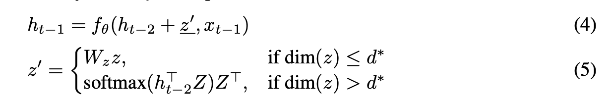
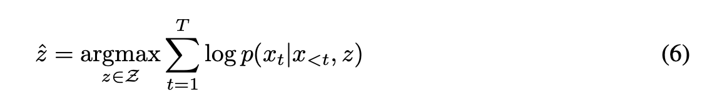
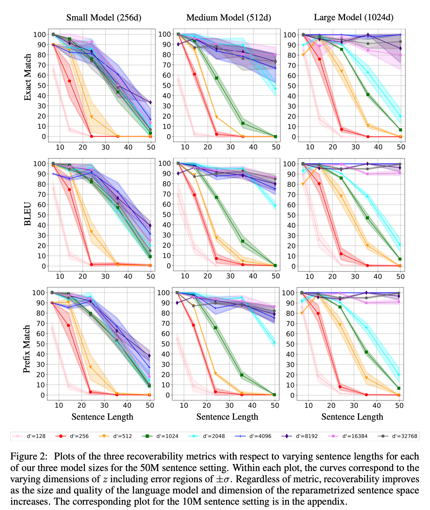
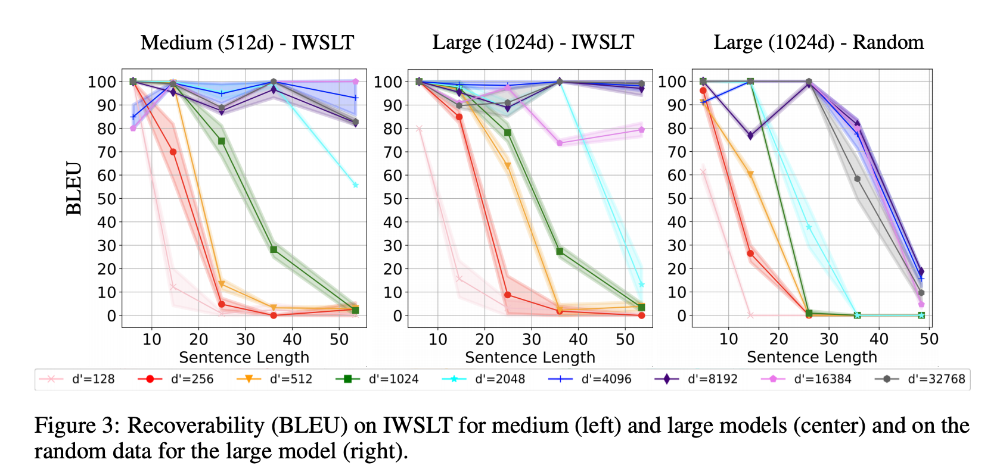

## Can Unconditional Language Models Recover Arbitrary Sentences?

### Reference

- [arXiv](https://arxiv.org/abs/1907.04944)

### Summary

- BERT가 general purpose sentence encoder 인 것 처럼, general purpose decoder도 만들 수 있을까?
  - 이게 가능하려면, 모든 target sentence에 대해서 어떤 continuous representation이 존재해서, LM을 통과하면 target sentence를 다시 만들 수 있어야 한다.
  - 이러한 representation을 만드는 encoder을 design 하는 대신, 이러한 representation이 존재하는지를 찾아보았다.
- 실험 결과
  - 최대 length 50 까지 실험한 결과, 거의 대부분 recover 하는 sentence representation dimension이 존재한다.
  - LM이 외워서 decoding을 하는 것일 수 있으므로, LM 학습에 쓰지 않은 out-of-domain sentences로도 실험해본 결과, 여기서도 잘 decoding 하는 것으로 보아 LM에 의한 memorization 보다는 generalization이 가능한 것 같다.

### Model

- Encoder-decoder을 사용한 게 아니라, decoder로 representation도 만들고 decoding도 하였다.
- 학습된 LSTM language model이 주어진 상태이다.
- LSTM language model에 sentence (x1, x2, ..., xT)를 넣으면 hidden state (h1, h2, ..., hT)를 얻을 수 있다.
- 이들을 reparametrize 하여 어떤 dimension d'을 갖는 representation vector z로 만든다.
- 이 z를 hidden state에 매 time step마다 더해준다. 모든 time step 마다 z를 더해주므로, 뒤로 갈 수록 z를 까먹지 않는다.
- z의 dimension이 decoder hidden state의 dimension과 맞지 않으면? 아래 식으로 decoder hidden state dimension d*와 맞춰준다.
- 
  - 여기서 W_z는 random matrix 이다.

### Experiment

#### In-domain

#### Out-of-domain

