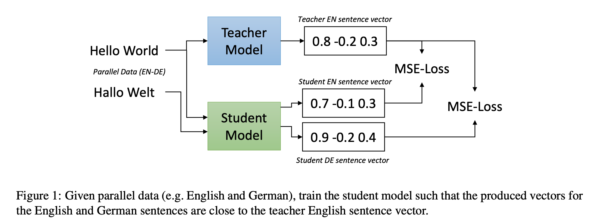

## Making Monolingual Sentence Embedding Multilingual using Knowledge Distillation

### Reference

- [arXiv](https://arxiv.org/abs/2004.09813)
- [code](https://github.com/UKPLab/sentence-transformers)

### Summary

- Goal

  - 언어 간에도 잘 align 되어 있고, 언어 내에서도 (비슷한 의미는 가까이 있도록) 잘 align 된 multilingual sentence embedding이 갖고 싶다.

- Preliminary

  - ALL NLI (SNLI, MNLI)와 STS-B에 의해 잘 학습된 영어 Sentence Bert가 존재 (Sentence Bert [[arXiv](https://arxiv.org/abs/1908.10084)] 참고)
  - mBERT, XLM-R 등 unsupervised 로 학습된 multilingual model이 존재
  - 각 언어에 대한 parallel data가 존재

- Method

  

  - Multilingual 을 하는 student model에는 영어를 포함한 임의의 언어의 문장을 넣음
  - 영어만 하는 teacher model은 student model에 대응하는 영어 문장을 넣음
  - Student model이 teacher model과 같은 output 값을 갖도록 MSE loss를 준다.

### Experiment

#### STS

- 한 언어 안에서의 align 평가

  

  - mBERT, XLM-R에 영어 nli-stsb만 학습시켜도 성능이 올라감 (로마자를 쓰지 않는 아랍어에서도)
  - Distillation을 했을 때 성능이 더 좋음

- cross-lingual align 평가

  

#### BUCC

- LASER보다 성능이 낮은데, 본 모델은 similar meaning을 학습했지만 이는 similar meaning이 곧 exact translation을 의미하지는 않는다고 말하고 있다.