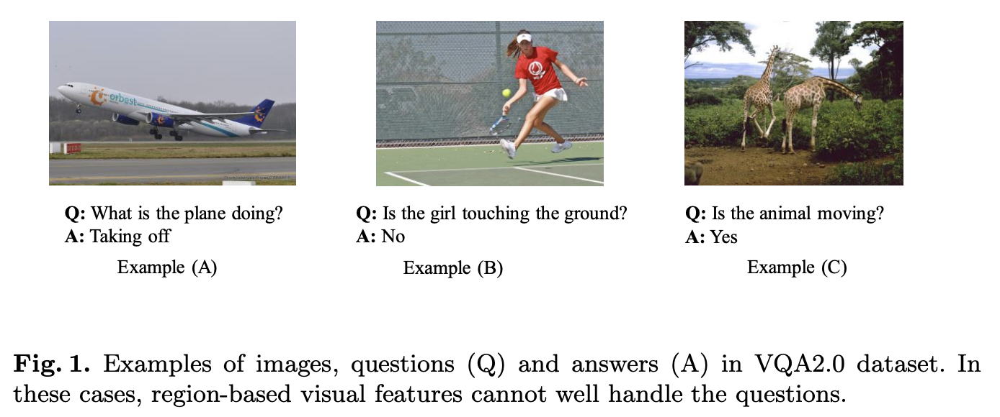
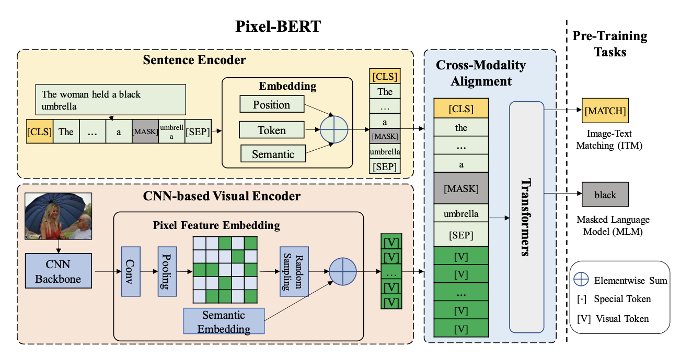
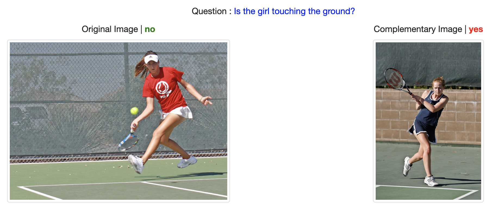
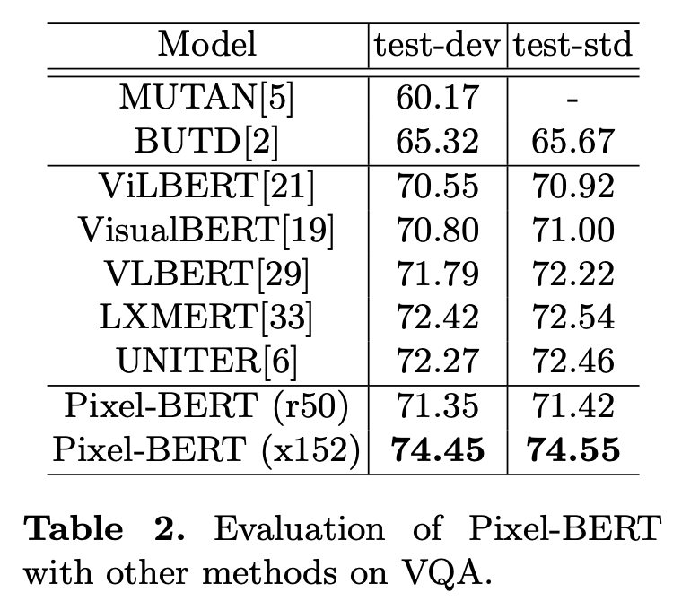
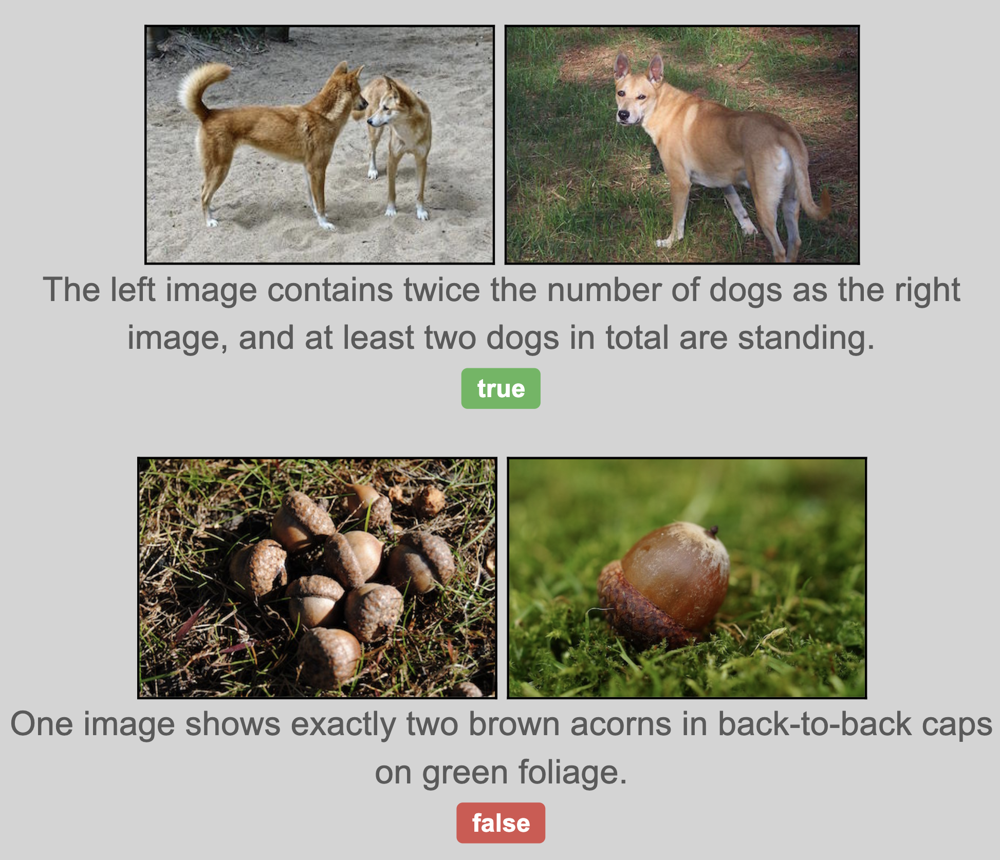
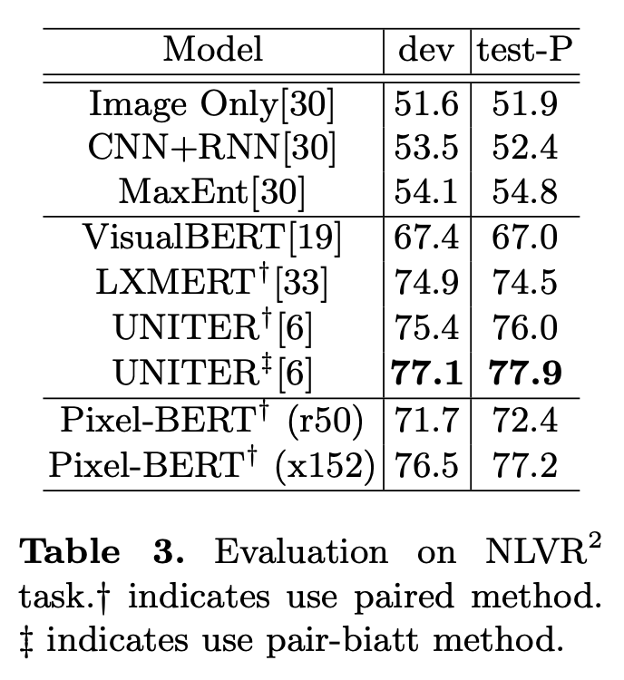
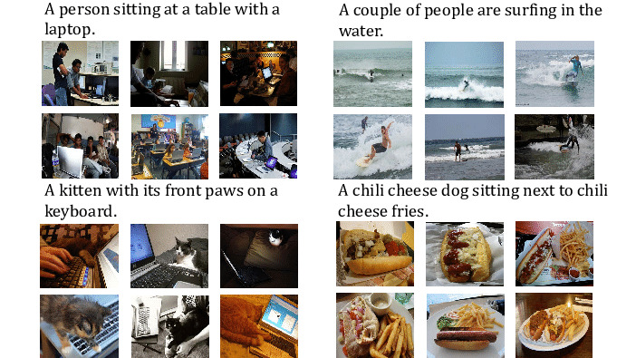
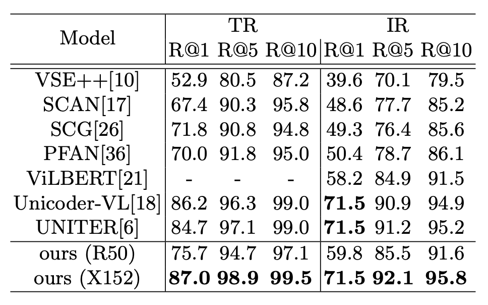
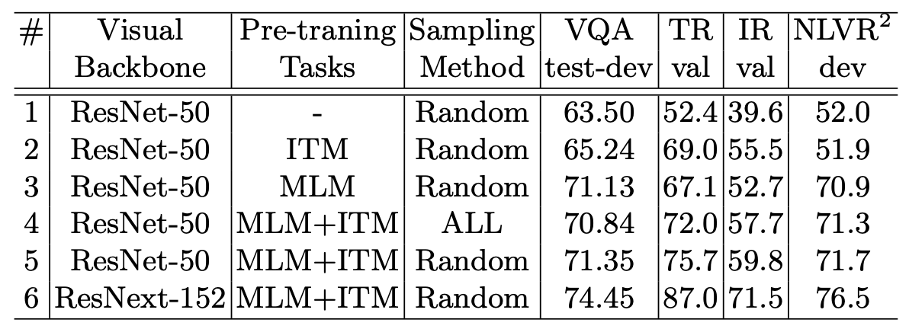
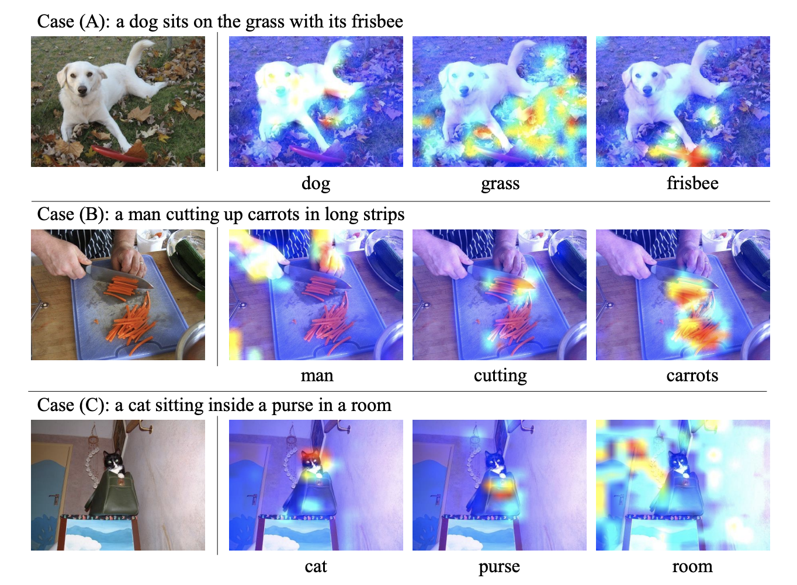

## Pixel-BERT: Aligning Image Pixels with Text by Deep Multi-Modal Transformers

Zhicheng Huang et al. 2020

 

### References

- [Pixel-BERT: Aligning Image Pixels with Text by Deep Multi-Modal Transformers](https://arxiv.org/abs/2004.00849)

 

### Summary

- _region-based_ 모델의 한계를 보완하기 위해 **Pixel** 정보를 활용하여 이미지 임베딩
	- **Bounding Box** 어노테이션은 굉장히 비용이 비싼 작업
	- _region-based feature_ 와 _textual feature_ 의 간극 존재
- **Pixel** 로 부터 추출한 _visual feature_ 와 **문장** 으로 부터 추출한 _textual feature_ 를 활용하여 **VQA**, **Image Retrieval** 등 **Multi-modal** 환경에서 좋은 성능 기록

 

### Introduction

- **텍스트** 와 **이미지** 의 크로스 모달리티를 다루는 모델에서는 _Semantic Gap_ 이 항상 존재
- _region-based visual feature_ 는 **Object Detection** 이라는 특정 태스크를 수행하기 위해 _feautre_ 를 추출하므로, _textual feature_ 와 **정보량의 차이**가 발생
- 또한 _feature representation_ 이 특정 클래스에만 한정되게 학습됨에 따라, 배경, 분위기 등에서 얻을 수 있는 정보가 유실

- 위 예제는 _region-based feature_ 의 여러 한계를 나타냄
	- (A) : Object Detection 모델이 비행기의 상태를 유추하기 어려움
	- (B) : **여자** 와 **땅** 을 검출할 수 있음에도 불구하고 두 객체를 나타내는 **Bounding box** 가 _overlapped_ 되어있기 때문에, **공간적 관계** 를 쉽유추하기 어려움
	- (C) : **기린** 이라는 정보만으로는 현재의 행동을 유추하기 어려움
- 즉, **Bounding box** 는 사각형으로 그려지기 때문에 배경에 노이즈가 낄 수 있으며, 객체의 형태 및 위치한 공간과의 정보가 유실된다는 치명적인 단점을 지님
- 이러한 한계를 극복하기 위해 **Bounding box** 패러다임에서 벗어나, **Pixel** 정보를 활용할 것

 

### Approach

- **문장 정보** 는 **토큰 임베딩** + **포지션 임베딩** + **타입 임베딩**
- **이미지 정보** 는 아래 과정을 통해 얻어짐
  - ResNet, ResNeXt 와 같은 _backbone_ 모델로부터 **피쳐** 추출
  - **Max Pooling** 통해 다운 샘플링
  - **Pixel Random Sampling**
  - 추출된 **피쳐** 에 **타입 임베딩** 더해줌
- 최종적으로 `[CLS] t_1 t_2 ... t_n [SEP] v_1 v_2 ... v_k` 의 **Multi-modal** 시퀀스 형성
- _region-based feature_ 와 달리 _backbone_ 에 **loss** 를 흘려 보내줄 수 있으므로, 태스크에 **보다 적합한 피쳐**를 학습할 수 있게 됨
- **사전 학습** 의 _objective_ 는 **MLM** + **ITM** (Image-Text Matching)
	- **ITM** 은 _textual feature_ 와 _visual feature_ 가 **Semantically Matched** 인지 여부를 예측
	- 훈련 데이터셋에 존재하는 **이미지-문장** 쌍은 _positive_ 로, 임의로 샘플링한 쌍은 _negative_ 로 설정해 학습
	- **MLM** 시에는 마스크 되지 않은 문맥 정보만 활용할 수 있던 기존 세팅과 달리, _visual token_ 도 함께 활용을 할 수 있게 되므로 **Cross Modality** 매핑이 이루어질 수 있음
- **Pixel Random Sampling**
	- 피쳐 학습 과정에서 _robustness_ 를 키우고, _overfitting_ 을 방지하기 위해,
	- _Pre-training_ 시, 임의로 _feature pixel_ 의 일부만 활용하는 전략 사용
	- 불완전한 _visual input_ 만 보고 학습을 하는 과정에서 _robustness_ 가 증진될 수 있으며,
	- 뿐만 아니라 전체 입력 값의 크기가 작아짐에 따라 **연산량** 을 줄여 훈련 속도를 가중시킬 수 있다는 장점
	- _Pre-training_ 시에는 **100개**의 피쳐만 추출해 활용
	- _Fine-tuning_ 시에는 샘플링 없이 전체 피쳐 활용
	

 

### Experiments

#### Visual Question Answering

**이미지** 와 **질문** 을 입력으로 받아, _yes/no_ 의 **이진 분류**

|      |
| :-----------------------------------: |
|  |

 

#### Natural Language for Visual Reasoning for Real

- 이미지에 대한 **묘사**가 **이미지 쌍**에 부합하는지 분류
- `[CLS] 묘사 [SEP] 이미지A` 와 `[CLS] 묘사 [SEP] 이미지B` 두 시퀀스에서 `[CLS]` 토큰을 각각 뽑은 후,
- 두 `[CLS]` 토큰을 _concat_ 해 _true/false_ 의 **이진 분류**

|      |
| :------------------------------------: |
|  |

 

#### Image-Text Retrieval

- **MS-COCO** 데이터셋을 활용해, 이미지가 주어졌을 때 **적절한 설명**을
- 혹은 설명이 주어졌을 때, **적절한 이미지**를 반환하도록 하는 태스크

|      |
| :-----------------------------------------: |
|  |

 

### Ablation Study and Visualization

- (1) 과 (2), (3) 을 비교해보면 **ITM** 과 **MLM** 모두 성능 향상에 큰 영향을 미침
- (4) 와 (5) 를 비교해보면 논문에서 제안한 **Pixel Random Smapling** 도 성능 향상에 영향을 미침
- (5) 와 (6) 을 비교해보면 _visual backbone_ 모델의 성능이 _downstream task_ 성능에도 직접적으로 영향을 미침

- **Pixel-BERT** 가 **Cross Modality** 를 제대로 학습하는지를 확인하기 위해 시각화 수행
- 시각화에는 **Pixel-BERT** 첫 번째 레이어의 _attention map_ 을 활용하였으며,
- 각 결과는 **언어 토큰** 이 _query_ 일 때, 어떠한 _visual token_ 이 _key_ 로 강하게 작용하는지를 보여줌
- (A) 를 보면 **강아지**, **풀**, **원반** 등의 토큰에 올바른 시각 정보가 강하게 반응함을 확인
- (B) 를 보면 _cutting_ 이 **동사** 임에도 불구하고, 해당 행위가 행해지는 **칼** 주위로 시각 정보가 잘 반응하는 것을 확인
- (C) 를 보면 **방** 이라는 토큰에 가장 적절한 시각 정보들이 반응하고 있는데, **Bounding box**를 활용하면 이같은 _segmentation_ 이 쉽지 않음을 고려했을 때 분명한 이점을 보임
- 공간 정보에 대한 _supervision_ 없이 위와 같은 결과를 만들어 내는 것을 보면, **Pixel-BERT** 의 접근법이 많은 가능성을 보유하고 있음을 알 수 있음