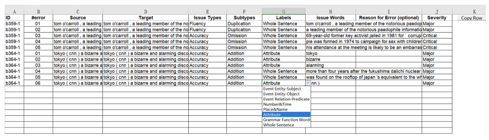
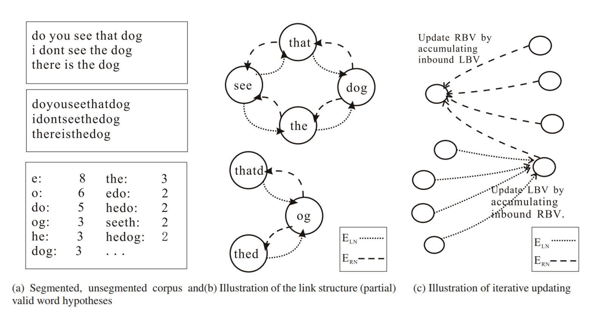
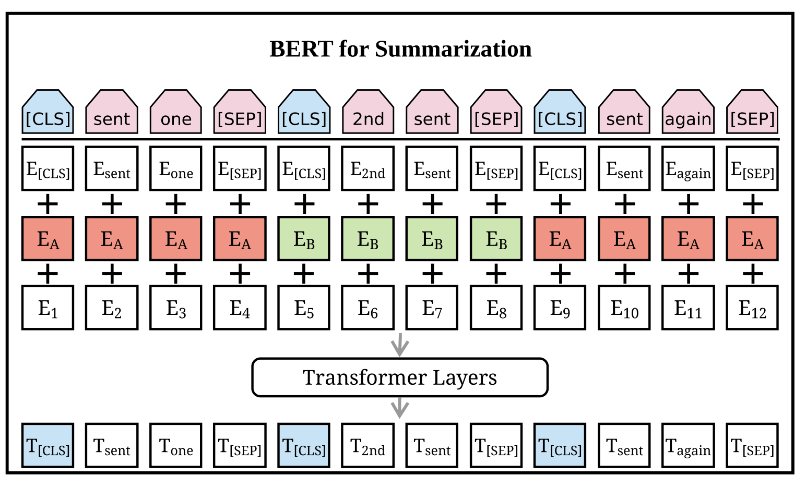
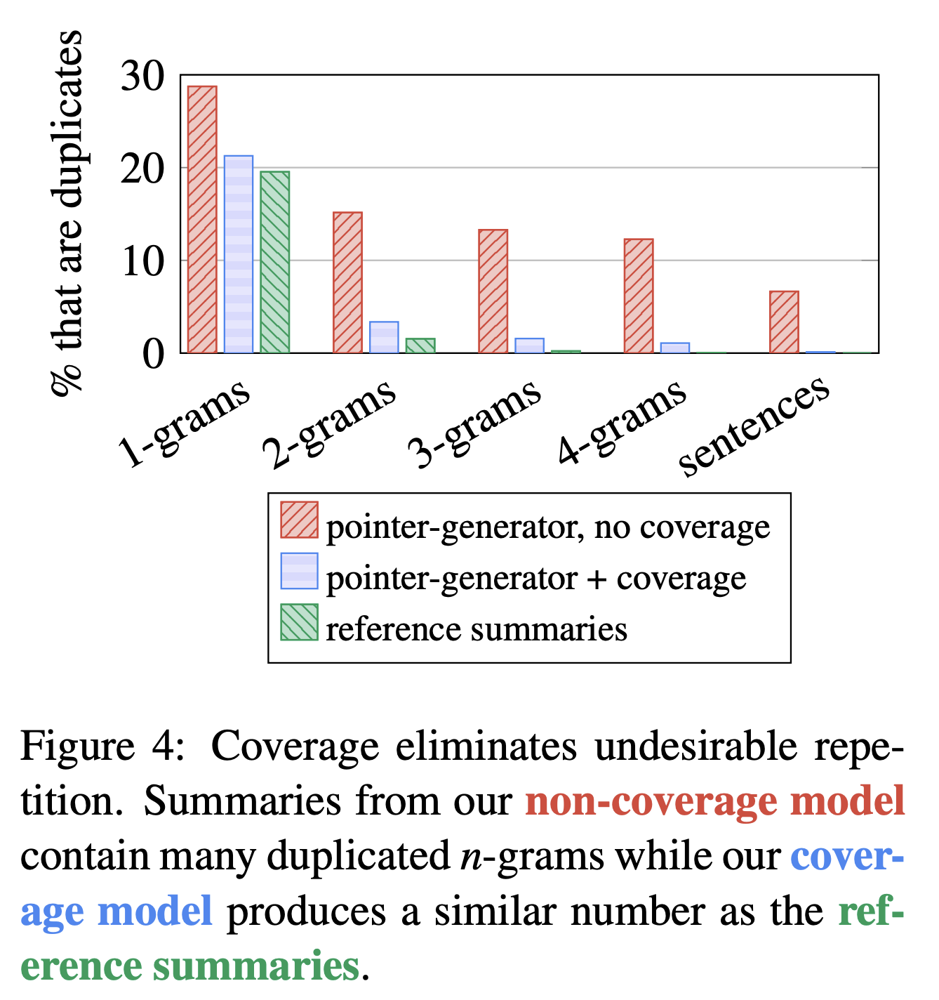
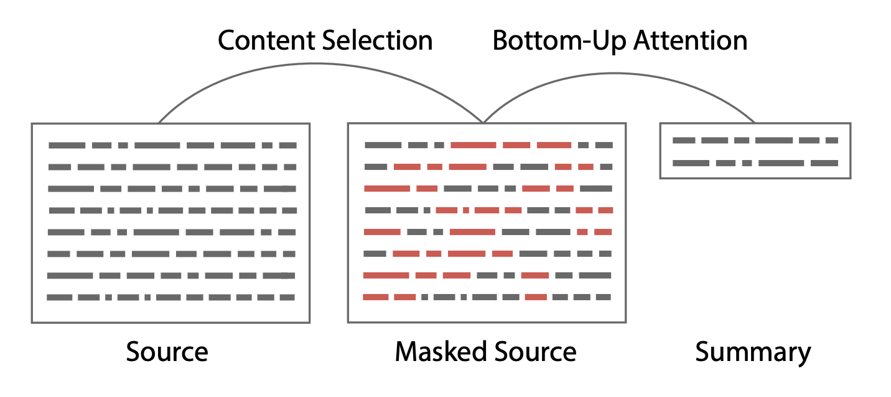
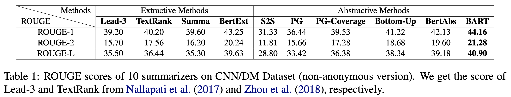
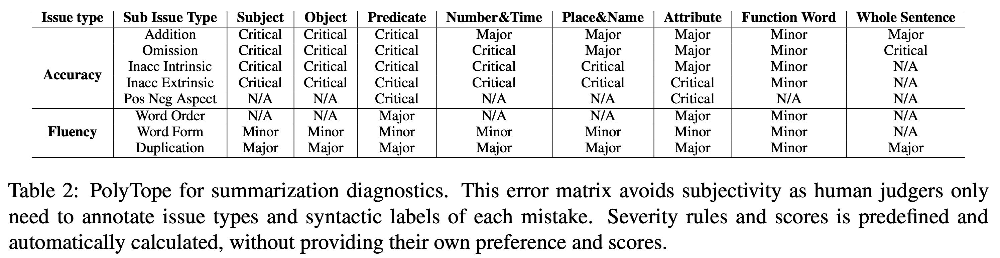
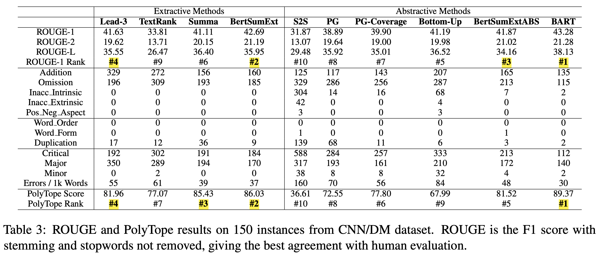
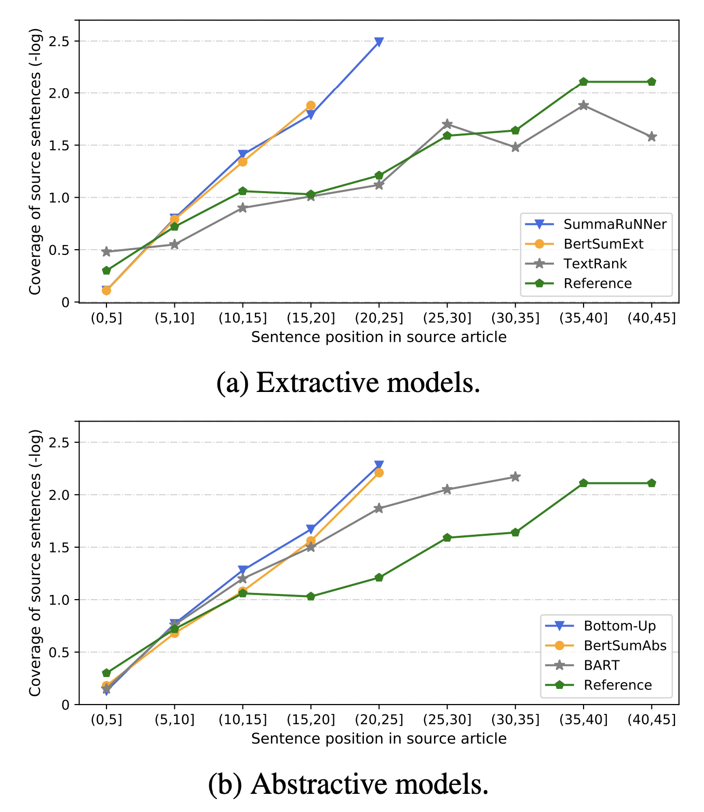

# What Have We Achieved on Text Summarization?

Dandan Huang et al. (Westlake Univ.)

 

## **References**

- [EMNLP 2020](https://arxiv.org/abs/2010.04529)

 

## **Summary**

- 요약 모델의 성능을 **ROUGE**로 측정하는 것에는 자명한 한계가 있음
- 이를 보완하기 위해 **Multidimensional Quality Metrics (MQM)** 을 고안하여, 다양한 베이스라인 모델들에 대해 성능 평가
- 실험 진행 결과 다음과 같은 결론을 얻을 수 있었음
	- 유사한 세팅에서는 **추출 요약** 모델이 **추상 요약** 모델보다 더 나은 요약을 만듦
	- 지금까지 고안된 **복사**, **커버리지** 등의 메커니즘은 실제로 성능 개선을 가져왔음
	- **사전 학습**은 **텍스트 요약** 태스크에 있어 확실히 효과가 있음

*MQM: MQM, Multidimensional Quality Metrics, is a (translation) quality assessment framework enables users to customize their own metrics for quality evaluation. It was developed to create shared quality metrics system for both human and machine translation and to improve automatic translation quality estimation.*

 

## **Introduction**

- **ROUGE**는 **요약** 태스크를 비롯한 여러 생성 태스크에 있어 불완전한 메트릭
- 때문에 최근 여러 다양한 연구에서 **사람이 개입한 평가**를 도입하려는 시도를 보이고 있음
- 그럼에도 그 범위와 평가 대상을 제대로 한정 짓지 못해 여전히 모델의 성능을 온전히 평가를 하고 있지는 못함
- 우리는 이러한 문제를 개선하기 위해 정확성 과 유창성 이라는 두 가지 특성을 평가하기 위한 **PolyTope** 고안 및 제시

 

## **Models** 

### **Lead-3**

- Lead-3는 요약 태스크에 있어 베이스라인으로 자주 활용되는 개념
- 직관적으로 생각해봤을 때, 뉴스 도메인의 첫 세 문장은 해당 기사의 초록이 될 수 있으므로 신뢰할 수 있는 소스

### **TextRank**

- TextRank는 그래프 기반의 비지도 랭킹 모델 

### **SummaRuNNer**

- 각 문장을 BiGRU에 태워 인코딩한 후, 모든 토큰들의 *hidden states* 를 가중합하여 문서 임베딩
- 문서 임베딩을 이진 분류기에 태워 해당 문장이 요약에 들어가야되는지를 분류

### **BertSumExt**

- BERT 문장 인코더로, 트랜스포머를 문서 인코더로 활용
- SummaRuNNer와 마찬가지로 각 문장의 임베딩이 이진 분류를 통해 요약에 포함될지가 결정

### **Seq2Seq (w. Attention)**

- Seq2Seq 아키텍처에 Attention 메커니즘을 적용한 기본적인 모델

### **Pointer-Generator**

- Seq2Seq 아키텍처가 약한 모습을 보이는 **사실 관계** 문제를 완화하기 위해 *Pointer* 개념 차용
- 디코더는 사전을 활용한 분포 + Pointer 분포를 적절히 활용해 요약문 생성

### **Pointer-Generator (w. Coverage)**

- 특정 단어가 반복적으로 생성되는 문제를 해소하기 위해 **Repetition Penalty**를 Loss에 더해주는 메커니즘 
- 디코더가 이전 타임스텝에 참조한 모든 Attention 분포를 *Coverage vector*에 담아 활용

### **Bottom-Up**

- 요약에 사용될 수 있는 단어들을 먼저 선정한 후, 해당 단어들을 활용해 요약을 생성하는 모델
- 해당 모델은 추상 요약과 추출 요약을 모두 활용하는 **Hybrid**의 대표격으로 선정

### **BertSumExtAbs**

- BertSumExt와 유사한 구조로 BERT 뒷단에 트랜스포머 디코더를 붙여, 생성 기반 요약을 수행
- 트랜스포머 디코더는 Randomly Init 상태에서 학습이 진행

### **BART**

- BERT와 같이 인코더만 사전학습 시키는 구조가 아닌, 양방향 인코더와 Auto-regressive한 디코더를 모두 사전학습 시키는 구조

 

## **Evaluation Method**

- 실험을 위해 시스템 점수는 **ROUGE**를 사람이 메기는 점수는 **PolyTope**를 활용
- ROUGE는 단순히 *Recall* 기반으로 레퍼런스와 겹치는 어휘를 얼마나 많이 생성했는지를 보는 메트릭
- PolyTope는 사람이 보기에 얼마나 모델이 많은 오류를 만들어 냈는지를 평가
- PolyTope에서 제시하는 이슈의 종류에는 총 8가지가 존재
- **Accuracy**: 모델이 생성한 요약문이 소스를 얼마나 정확하게 표현하는지를 보는 지표
	- *Addition*: 소스에서 불필요한 문장을 요약에 포함
	- *Omission*: 중요한 부분을 생략
	- *Inaccuracy Intrinsic*: 소스 정보가 부정확하게 해석되어 신뢰할 수 없음 
	- *Inaccuracy Extrinsic*: 소스에 존재하지 않던 요약을 생성해, 사실 관계에서 그릇됨 
	- *Positive-Negative Aspect*: 소스와 요약의 긍부정이 역전
- **Fluency**: 유창성은 소스와 타겟의 관계가 아닌 단순한 언어적 특징을 보는 지표
	- *Duplication*: 이미 사용된 문구 및 단어가 반복되어 재사용됨 
	- *Word Form*: 단어의 시제, 태, 품사 등이 잘못되게 사용됨 
	- *Word Order*: 문장을 구성하는 단어의 순서가 뒤바뀜

- 이슈의 심각성 정도는 어노테이터마다 다를 수 있기 때문에, 설계자가 미리 직접 지정해 이견이 생기는 것을 방지

 

## **Evaluating Model Performance**

### **Preneural vs Neural Models**

- ROUGE-1에 비추어 봤을 때, Lead-3는 **추출 요약** 모델 중 2위를, 전체 모델 중 4위를 기록 
- PolyTope에 비추어 봤을 때는 **추출 요약** 모델 중 3위를, 전체 모델 중 4위를 기록
- 이는 여전히 신경망 기반 모델에 비해 간단한 베이스라인 모델들이 강점을 보이고 있음을 증명

### **Extractive vs Abstractive Summarization**

- ROUGE 기준으로는 **추출 요약**과 **추상 요약**이 큰 성능 차이를 보이지 않음
- PolyTope기준으로 BART가 다른 모델을 압도하긴 했지만, BART를 제외하고는 **추출 요약** 모델들이 2, 3, 4위를 기록
- 따라서 유사한 세팅에서는 **추출 요약** 모델들이 더 좋은 선택지라고 할 수 있음

### **Extractive Methods**

- ROUGE-L, PolyTope 기준으로 BertSumExt와 SummaRuNNer이 큰 차이를 보이지 않음
- 이는 **추출 요약**에 있어 Contextualized Representation이 큰 효과를 주지 못한다는 이전 연구 결과들에 *align*

### **Abstractive Methods**

#### Copy

- Naive Seq2Seq은 소스의 사실 관계를 파악하는데 있어 어려움을 많이 겪어왔음
- **Pointer-Generator**는 해당 이슈를 *copy* 메커니즘으로 일정 부분 해소
- 흥미로운 점은 *Inaccuracy Intrinsic* 뿐만 아니라 *Duplication* 문제도 어느 정도 해소를 했다는 점
- 단순하게 생각해보면 Naive Seq2Seq은 디코딩 히스토리에 기반해 생성을 하므로, 디펜던시를 *short-term* 하게만 볼 수 있 지만, **Pointer-Generator**는 *copy* 메커니즘 덕분에 *copy prob* 과 *vocab prob*을 적절히 사용해 *long-term* 을 볼 수 있음

#### Coverage

- *coverage* 메커니즘은 의도한대로 **반복 생성**을 하는 문제를 해결
- 그러나 기존에 발생하던 **Addition**과 **Inaccuracy Intrinsic** 에러보다 더 많은 에러를 발생시키며, 사실 관계를 제대로 파악 하지 못하는 문제 존재

#### Hybrid Abstractive/Extractive Model

- `Bottom-Up` 모델은 ROUGE에서 좋은 성능을 보였지만, PolyTope에서는 9위를 기록 
- 특히 **Inaccuracy** 문제가 매우 심각한 모습을 보임
- Bottom-Up 의 장점은 소스에서 미리 세그먼트를 뽑기 때문에 **Recall**에서 강함
- 그러나 기추출된 세그먼트만 활용하여 요약을 생성해야 하기 때문에 *Inaccuracy Intrinsic* 문제가 필연적으로 발생

#### Pre-training

- `BART`는 모든 면에서 압도
- 특히 소스 문장을 사용하는 행태를 보면, 다른 모델들보다 더 다양한 부분에서 정보를 따오는 것을 볼 수 있음 
- 이는 `Lead-3` *bias*가 심한 **요약** 태스크 환경으로 비추어 보았을 때, 중요한 장점